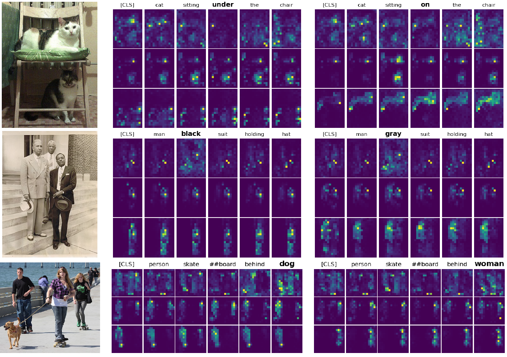

# Word2Pix: Word to Pixel Cross-Attention Transformer in Visual Grounding
[Word2Pix: Word to Pixel Cross-Attention Transformer in Visual Grounding](https://arxiv.org/pdf/2108.00205.pdf)

### Introduction
We propose Word2Pix: a one-stage visual grounding network based on encoder-decoder transformer architecture that enables learning for textual to visual feature correspondence via word to pixel attention. Each word from the query sentence is given an equal opportunity when attending to visual pixels through multiple stacks of transformer decoder layers; thus is able to focus on grounding-critical words rather than words that are dominant for the sentence representation. Refer to our [paper](https://arxiv.org/pdf/2108.00205.pdf) for more details.
<p align="center">  </p>

### Prerequisites
* Python 3.8
* Pytorch 1.8.0
* Torchvision 0.9.0

## Installation and Data preparation
1. Clone the repository
```
git clone https://github.com/azurerain7/Word2Pix
```
2. Download MSCOCO images(Refcoco/+/g images are subsets) and Refcoco/+/g annotations
* Download and extract COCO 2017 train and val images from
[http://cocodataset.org](http://cocodataset.org/#download).
The default directory paths(argument 'coco_path == ./cocopth') should be the following structure:
```
./cocopth/
  annotations/  # annotation json files
  train2017/    # train images
  val2017/      # val images
```
* Follow [REFER](https://github.com/lichengunc/refer) to download the Refcoco/+/g annotations; then follow the training step 1 in [MAttNet](https://github.com/lichengunc/MAttNet) to extract relevant grounding information. To facilitate and skip this step, we provide preprocessed training and evaluation data of Refcoco/+/g for downloading through this [link]().


## Performance
We provide the pretrained model weights in [GDRIVE]().
<table>
    <thead>
        <tr>
            <th>Datasets \ backbone</th>
            <th>ResNet-101</th>
        </tr>
    </thead>
    <tbody>
        <tr>
            <td rowspan=3>RefCOCO</td>
            <td>val: 81.12</td>
        </tr>
        <tr>
            <td>testA: 84.39</td>
        </tr>
        <tr>
            <td>testB: 78.12</td>
        </tr>
        <tr>
            <td rowspan=3>RefCOCO+</td>
            <td>val: 69.46</td>
        </tr>
        <tr>
            <td>testA: 76.81</td>
        </tr>
        <tr>
            <td>testB: 61.57</td>
        </tr>
        <tr>
            <td rowspan=2>RefCOCOg</td>
            <td>val-umd: 70.81</td>
        </tr>
        <tr>
            <td>test-umd: 71.34</td>
        </tr>
    </tbody>
</table>

## Training and Evaluation
1. Training, check all related arguments and flags in script.
```
CUDA_VISIBLE_DEVICES=0,1,2,3 python3.8 -m torch.distributed.launch --nproc_per_node=4 --use_env train_w2p.py
```
2. Testing, check all related arguments and flags in script.
```
CUDA_VISIBLE_DEVICES=0 python3.8 test_w2p.py
```

## Citation

    @misc{
      author = {Zhao, Heng and Zhou, Joey Tianyi and Ong, Yew-Soon},
      title = {Word2Pix: Word to Pixel Cross Attention Transformer in Visual Grounding},
      publisher = {arXiv https://arxiv.org/abs/2108.00205},
      year = {2021}
    }

## Credits
Our code is built on [DETR](https://github.com/facebookresearch/detr) and partial of the codes are from [MAttNet](https://github.com/lichengunc/MAttNet).
